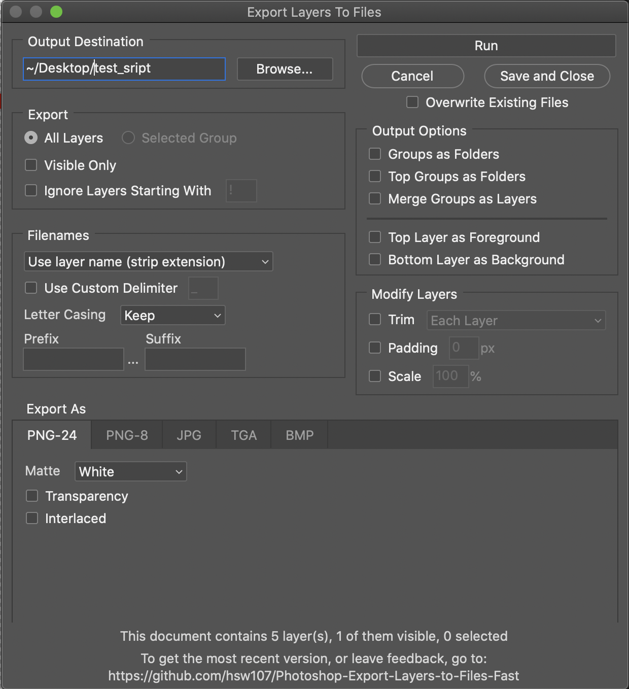

# Photoshop-Export-Layers-to-Files-Fast

This script allows you to export layers in your Photoshop document as individual files at a speed much faster than the built-in script from Adobe.

This script does not try to achieve feature parity with the built-in script, but rather provide a more streamlined / performant experience. That being said, feel free to [make feature requests](https://github.com/hsw107/Photoshop-Export-Layers-to-Files-Fast/issues/new), and feel free to contribute to it and make it even more powerful!

## How to Use

_Disclaimer:_ We are not associated with Adobe in any way. For any issues relating to Adobe products or Adobe scripts please contact them directly. We have never had an issue, but **please use this script at your own risk**. We are not responsible for any lost data or damaged PSDs so always make a back-up.

- Go to the [releases page](https://github.com/hsw107/Photoshop-Export-Layers-to-Files-Fast/releases) and download [the most recent release](https://github.com/hsw107/Photoshop-Export-Layers-to-Files-Fast/releases/latest).
- In Photoshop go to `File -> Scripts -> Browse...` and select the `Export Layers To Files (Fast).jsx` file.
- You can add the script to the Scripts menu by adding all of the script files to `Photoshop > Presets > Scripts`
  - Windows: `/Program Files/Adobe/Adobe Photoshop VERSION/Presets/Scripts`
  - Mac: `/Applications/Adobe Photoshop VERSION/Presets/Scripts`

## Example Screenshot

## Features

Some of the features of the script include...

- Supported export formats:
  - PNG (8 and 24 bit)
  - JPEG
  - TIFF
  - PDF
  - Targa
  - BMP
  - PSD
- Handles nesting in grouped layers
- Export either all layers or visible only
- Files are named either using layer names, layer + group names, or automatic layer indices
- Lowest layer can be treated as common background
- Exported images can have layer size or canvas size (trimming option)
- Last used dialog settings are remembered
- A selected group can be exported as usual (layer by layer) while everything else is left in tact. (This way variable content can be exported for complex fixed background and foreground.)
- Can export groups as folder hierarchy; conflicting folders are renamed

## Extra Field Documentation

### Selected Group

Will only export the selected group. Note that you must selected the group before launching the script, otherwise this option will be disabled. When you run the script this way, all other layers will be left untouched, meaning any visible layers on top or bottom may show in the export.

### Ignore Layers Starting With

When this is selected, you can specify a prefix that will be used to match against layer names. Any matching layers will be ignored during the export.

For example, if you specify `x` in the input, all layers starting with the letter `x` will not be exported.

### Filenames

| Option                             | Example                                                    |
| ---------------------------------- | ---------------------------------------------------------- |
| `Use Layer Name (strip extension)` | `layer-3.png` => `layer-3.png`                             |
| `Use Layer Name (keep extension)`  | `layer-3.png` => `layer-3.png.png`                         |
| `Use layer and parent group names` | `group 1 > layer-3` => `group-1-layer-3.png`               |
| `Use index descending`             | `layer-10`, where `layer-10` is the top-most layer => `01` |
| `Use index ascending`              | `layer-5`, where `layer-5` is the top-most layer => `5`    |

### Use Custom Delimiter

`Use Custom Delimiter` will enable the use of a custom delimiter. Custom delimiters will be used instead of spaces in layer names and in the prefix/suffix fields. Note that the use of a space inside the file name is not supported by Photoshop, so by default a `-` delimiter will be used if not custom delimiter is specified.

For example:
`my layer 1` will export as `my-layer-1`

The following characters are **not** supported in the delimiter field:
`\`, `/`, `*`, `?`, `|`, `.`, `:`, `"`, `<`, `>`, `%`, `,`, `;`, `=`

### Prefix/Suffix

`Prefix` and `Suffix` will add a prefix and suffix, respectively, to every exported filename, and is compatible with all the options in Filenames above.

The following characters are **not** supported in the prefix or suffix field:
`\`, `/`, `*`, `?`, `|`, `:`, `"`, `<`, `>`

| Prefix    | Suffix       | Output Example               |
| --------- | ------------ | ---------------------------- |
| `test-`   | N/A          | `test-layer-3.png`           |
| N/A       | `.scale-100` | `layer-3.scale-100.png`      |
| `test-`   | `.scale-100` | `test-layer-3.scale-100.png` |
| `{ii}-`   | N/A          | `04-layer-3.png`             |
| `{YYYY}-` | N/A          | `2021-layer-3.png`           |

#### Variable Substitution

Prefix and Suffix fields can take the following string substitutes.

| Option   | Example                                                                                  |
| -------- | ---------------------------------------------------------------------------------------- |
| `{i}`    | Will be replaced with the index of the layer                                             |
| `{ii}`   | Will be replaced with the index of the layer, with a leading zero                        |
| `{iii}`  | Will be replaced with the index of the layer, with up to two leading zeros               |
| `{iiii}` | Will be replaced with the index of the layer, with up to three leading zeros             |
| `{ln}`   | Will be replaced with the layer name. Useful for when exporting filenames as their index |
| `{dn}`   | Will be replaced with the document name                                                  |
| `{M}`    | Will be replaced with the month                                                          |
| `{MM}`   | Will be replaced with the month, with a leading zero                                     |
| `{D}`    | Will be replaced with the date of the month                                              |
| `{DD}`   | Will be replaced with the date of the month, with a leading zero                         |
| `{YY}`   | Will be replaced with the year, as the last two digits                                   |
| `{YYYY}` | Will be replaced with the year, as all four digits                                       |
| `{HH}`   | Will be replaced with the hours, with a leading zero                                     |
| `{mm}`   | Will be replaced with the minutes, with a leading zero                                   |
| `{ss}`   | Will be replaced with the seconds, with a leading zero                                   |
| `{sss}`  | Will be replaced with the milliseconds, with leading zeros                               |

### Known Gaps

- Currently we do not support multiple artboards for export

## Requirements

We do our best to have the script be backwards compatible (back to Adobe Photoshop CS2) but are limited in what we can test for, both by Photoshop versions as well as OS. If you are encountering any issues with the current version, try downloading [previous versions](https://github.com/hsw107/Photoshop-Export-Layers-to-Files-Fast/releases) of the script instead.

## Contributing

Please feel free to contribute! We appreciate it!

Here are some things to know:

- When updating the dialog UI, please reference the `dev/dialog.js` and import it at https://scriptui.joonas.me/. Then, when you've made the appropriate UI changes, export the dialog and copy/paste the top comment block into the `dev/dialog.js` file and copy/paste the remainder into the `showDialog` function inside `Export Layers To Files (Fast).jsx`.
- Be sure to test that any UI you add gets saved between script runs. i.e. If the user checks a checkbox, that checkbox should remain checked the next time they run the script.

## Feedback / Bugs

Please use GitHub to write feedback/bugs/suggestions by [filing an issue](https://github.com/hsw107/Photoshop-Export-Layers-to-Files-Fast/issues).

If you encounter a bug, please include the following information:

- Your OS and OS Version
- Your Photoshop version and release number
- A screenshot (if applicable)
- A `.psd` that reproduces the issue (the simpler the better)
