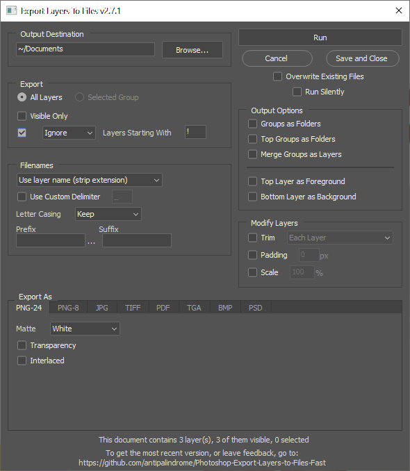

# Photoshop-Export-Layers-to-Files-Fast

This script allows you to export layers in your Photoshop document as individual files at a speed much faster than the built-in script from Adobe.

This script does not try to acheive feature parity with the built-in script, but rather provide a more streamlined / performant experience. That being said, feel free to make feature requests, and feel free to contribute to it and make it even more powerful!

## How to Use

_Disclaimer:_ We are not associated with Adobe in any way. For any issues relating to Adobe products or Adobe scripts please contact them directly. We have never had an issue, but **please use this script at your own risk**. We are not responsible for any lost data or damaged PSDs so always make a back-up.

- Go to the [releases page](https://github.com/hsw107/Photoshop-Export-Layers-to-Files-Fast/releases) and download the most recent release.
- In Photoshop go to `File -> Scripts -> Browse...` and select the `Export Layers To Files (Fast).jsx` file.
- You can add the script to the Scripts menu by adding all of the script files to `Photoshop > Presets > Scripts`
  - Windows: `/Program Files/Adobe/Adobe Photoshop VERSION/Presets/Scripts`
  - Mac: `/Applications/Adobe Photoshop VERSION/Presets/Scripts`

## Example Screenshot

## Features

Some of the features of the script include...

- Supported export formats:
  - PNG (8 and 24 bit)
  - JPEG
  - Targa
  - BMP
- Handles nesting in grouped layers
- Export either all layers or visible only
- Files are named either using layer names, layer + group names, or automatic layer indices
- Lowest layer can be treated as common background
- Exported images can have layer size or canvas size (trimming option)
- Last used dialog settings are remembered
- A selected group can be exported as usual (layer by layer) while everything else is left in tact. (This way variable content can be exported for complex fixed background and foreground.)
- Can export groups as folder hierarchy; conflicting folders are renamed

### Known Gaps

- Currently we do not support multiple artboards for export

## Requirements

We do our best to have the script be backwards compatible (back to Adobe Photoshop CS2) but are limited in what we can test for, both by Photoshop versions as well as OS. If you are encountering any issues with the current version, try downloading [previous versions](https://github.com/hsw107/Photoshop-Export-Layers-to-Files-Fast/releases) of the script instead.

## Feedback / Bugs

Please use GitHub to write feedback/bugs/suggestions by [filing an issue](https://github.com/hsw107/Photoshop-Export-Layers-to-Files-Fast/issues).

If you encounter a bug, please include the following information:

- Your OS and OS Version
- Your Photoshop version and release number
- A screenshot (if applicable)
- A `.psd` that reproduces the issue (the simpler the better)
